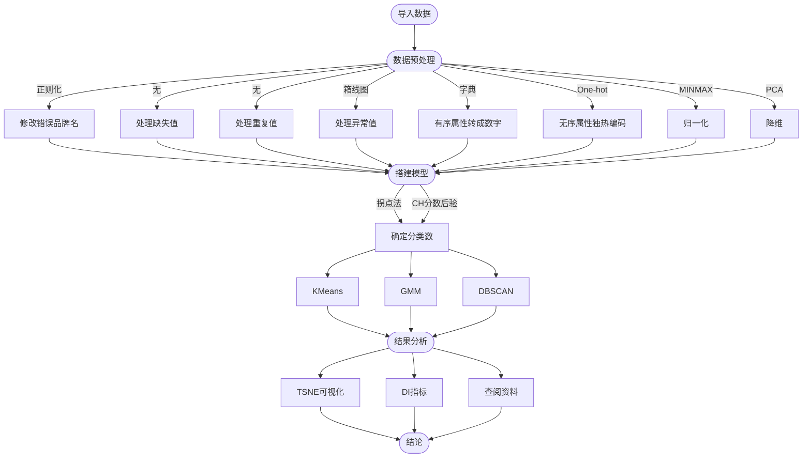

## 说明

### 1、项目简介

​		// 本项目以竞品分析为背景，通过数据的聚类，为汽车提供聚类分类。对于指定的车型，可以通过聚类分析找到其竞品车型。通过这道赛题，鼓励学习者利用车型数据，进行车型画像的分析，为产品的定位，竞品分析提供数据决策。

​		// 选手需要对该汽车数据进行聚类分析，并找到vokswagen汽车的相应竞品。要求选手在天池实验室中用notebook完成以上任务，并分享到比赛论坛。
（聚类分析是常用的数据分析方法之一，不仅可以帮助我们对用户进行分组，还可以帮我们对产品进行分组（比如竞品分析） 这里的聚类个数选手可以根据数据集的特点自己指定，并说明聚类的依据）

### 2. 环境配置

1. 运行环境： `python3`
2. 使用的库： `numpy, matplotlib, pandas, scikit-learn, seaborn`
3. 库的安装： `pip install -i`

### 3. 运行命令

1. 运行： `python3 cluster.py`

### 4. 目录

​	| - `README.md`						// *help*

​	| - `code`

​		\ - `cluster.py`				// *聚类算法主函数*

​		\ - `my_function.py`		// *自定义函数*

​	| - `picutres`

​		\ - `Original boxplot.png`

​		\ - `Processed boxplot.png`

​		\ - `Heat Map.png`

​		\ - `Variance contribution.png`

​		\ - `Best K by SSE.png`

​		\ - `Comparison.png`

​		\ - `visualized_KMeans.png`

​		\ - `visualized_GM.png`

​	| - `dataset`

​		\ - `car_price.csv`

### 5. 代码结构

### 6. 版本

​	$latest\ modified: 2021.11.3$​​​

​	$V1.0$		数据预处理 + 模型框架

​	$V1.0.1$    添加详细注释，修改部分bug

​	$V1.1$        封装复杂函数并添加函数说明

​	$V1.2$​		实现 $KMeans\&GM$ 模型的对比

​	$V2.0$		使用 $TSNE$ 可视化，根据可视化结果修改参数

​	$V2.1$		使用 $DI$ 指标评价模型		

​	$V2.2$		添加 $DBSCAN$ 模型进行聚类，效果更优

### 7. 作者

​	$HTY$

### 8. 贡献者

​	$AT, MYF$

### 9. 参考

​	周志华《机器学习》

​	`CSDN`各路神仙

​	天池赛题讨论区

